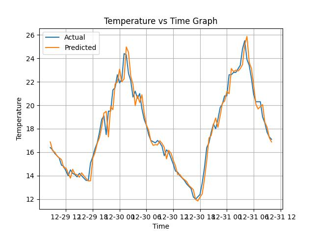
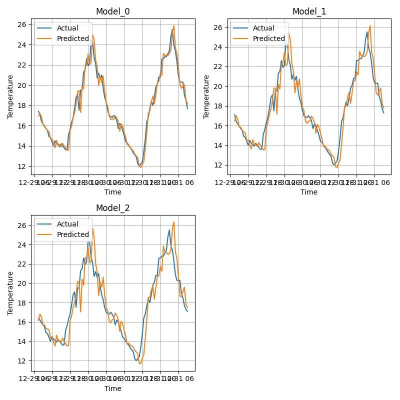

 <h1 align="center">Temporature prediction</h1>

## Introduction
In this project, I employ time series analysis techniques to predict temperature values. By analyzing historical temperature data, I aim to create a model that can provide accurate temperature forecasts.

## Dataset
I use a dataset containing historical temperature records. You can find the dataset at **temperature.csv**.

10 samples in this dataset.

|Time|Temperature|   
|----|:---------:|
|2011-12-31T13:00:00Z|21.4|
|2011-12-31T13:30:00Z|21.05|
|2011-12-31T14:00:00Z|20.7|
|2011-12-31T14:30:00Z|20.55|
|2011-12-31T15:00:00Z|20.4|
|2011-12-31T15:30:00Z|20.25|
|2011-12-31T16:00:00Z|20.1|
|2011-12-31T16:30:00Z|19.6|
|2011-12-31T14:30:00Z|19.1|
|2011-12-31T15:00:00Z|18.95|

## Method

### Recursive Time Series Forecasting
In the Recursive Time Series Forecasting method, I use historical temperature data to predict future values one step at a time.

#### Create a recursive dataset with a window size of 5 from [this dataset](#sample)

|Temperature|Temperature_1|Temperature_2|Temperature_3|Temperature_4|target|  
|-----------|:-----------:|:-----------:|:-----------:|:-----------:|:----:|
|21.4|21.05|20.7|20.55|20.4|20.25|
|21.05|20.7|20.55|20.4|20.25|20.1|
|20.7|20.55|20.4|20.25|20.1|19.6|
|20.55|20.4|20.25|20.1|19.6|19.1|
|20.4|20.25|20.1|19.6|19.1|18.95|

#### Trained model
You could find at **model_recusive.pkl**

#### Evaluation
* R2 score: 0.9862135529617928
* Mean absolute error: 0.36944128469038023
* Mean squared error: 0.32951367709724566 

#### Plot the actual and predicted temperature over time (100 data points)

### Direct Time Series Forecasting
In the Direct Time Series Forecasting method, I utilize historical temperature data to directly predict multiple future values in a single step. (using multiple models)

#### Create a direct dataset with a window size of 5 and a target size of 3 (using 3 models) from [this dataset](#sample)

|Temperature|Temperature_1|Temperature_2|Temperature_3|Temperature_4|target_0|target_1|target_2|
|-----------|:-----------:|:-----------:|:-----------:|:-----------:|:------:|:------:|:------:|
|21.4|21.05|20.7|20.55|20.4|20.25|20.1|19.6|
|21.05|20.7|20.55|20.4|20.25|20.1|19.6|19.1|
|20.7|20.55|20.4|20.25|20.1|19.6|19.1|18.95|

#### Trained models
You could find at **model_direct.pkl**

#### Evaluation
|Metric|Model_1|Model_2|Model_3|
|-----------|:-----------:|:-----------:|:-----------:|
|R2 score|0.9862156864978485|0.9654280037461876|0.9373594245073072|
|Mean absoluate error|0.36943193645662054|0.6021966226577993|0.8319678639533676|
|Mean squared error|0.3295113928844136|0.8263742707648775|1.4971896899093258|

#### Plot the actual and predicted temperature over time (100 data points)

     
## Requirements
* python
* pandas
* sklearn
* matplotlib
